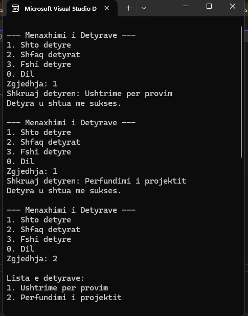

#  Menaxhimi i Detyrave – C++


## Pershkrimi i Projektit
Ky projekt eshte zhvilluar ne gjuhen programuese **C++** dhe ka per qellim menaxhimin e detyrave permes 
nje aplikacioni te thjeshte ne **console**. Projekti sherben gjithadhtu si demonstrim praktik i perdorimit te **GitHub**
per menaxhimin e kodit buroimor, duke perfshire perdorimin e **branches**, **pull requests** dhe **merge**.

## Funksionalitetet kryesore
Aplikacioni ofron keto funksione:
- **Shtimi i detyrave**
- **Shfaqja e listes se detyrave**
- **Fshirja e nje detyre sipas numrit**
- **Dalja nga aplikacioni**

Te gjitha detyrat ruhen ne memorie gjate ekzekutimit te programit.

## Si te ekzekutohet projekti lokalisht
Projekti mund te ekzekutohet duke perdorur **Microsoft Visual Studio**.

Hapat:
1. Klono repository-n nga GitHub:
```bash
git clone https://github.com/KimeteSadiku1/projekti4-github-c--menaxhim-detyra.git
```

2. Hap file-in e projektit:
Project4.sln ne Visual Studio 2022

3. Ekzekuto aplikacionin:
Ctrl + F5 (Start Without Debugging)

## Shembull i ekzekutimit te programit





